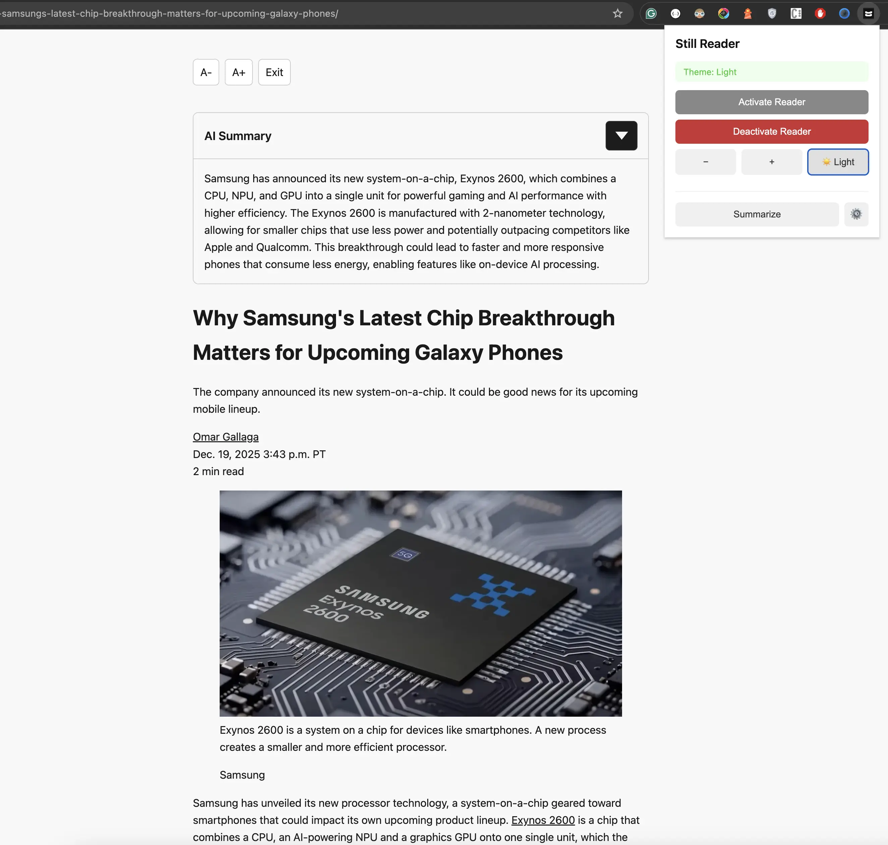
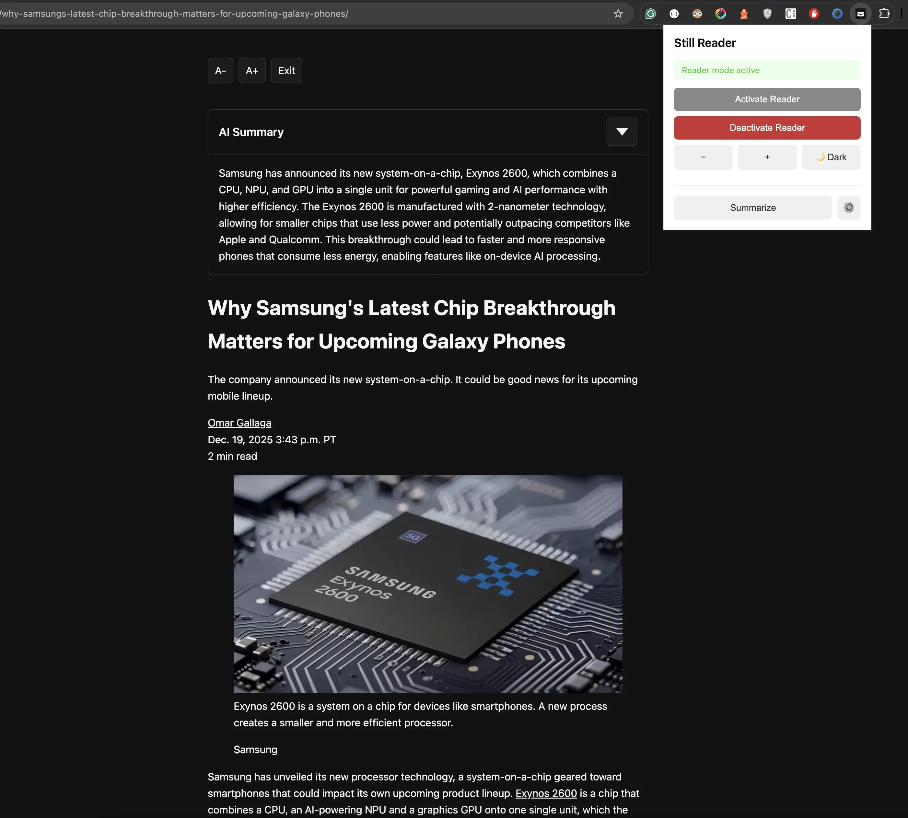

# Still Reader

A Chrome extension that provides a distraction-free reading experience by extracting and displaying article content in a clean, customizable interface. Includes optional AI-powered summarization using multiple provider APIs.

## Features

- **Article Extraction**: Automatically extracts main content from web pages, removing ads, navigation, and other distractions
- **AI Summarization**: Generate concise summaries using OpenAI, Anthropic, Groq, Gemini, or custom API providers
- **Customizable Reading Experience**: 
  - Light/dark theme support
  - Adjustable font scaling
  - Scroll position restoration on deactivation
- **Keyboard Shortcuts**: 
  - Toggle reader: `Ctrl+Shift+R` (Windows/Linux) / `Command+Shift+R` (Mac)
  - Activate reader: `Alt+R` (Windows/Linux) / `Option+R` (Mac)
  - Summarize: `Alt+S` (Windows/Linux) / `Option+S` (Mac)
- **Privacy-Focused**: All processing happens locally; AI features require user-provided API keys

## Screenshots

### Reader Mode with AI Summary

The extension extracts article content and displays it in a clean, distraction-free interface. The AI summary feature provides concise overviews of articles using configurable AI providers.


*Reader mode in light theme displaying article content with AI summary. The popup shows theme and reader controls.*


*Reader mode in dark theme with AI summary expanded, showing the extracted article content and extension popup controls.*

## Tech Stack

TypeScript, Chrome Extension Manifest V3, Vite, Vitest

## Architecture

The extension is organized into modular components:

- **Extraction** (`src/extraction/`) - Content extraction algorithms and DOM analysis
- **Content** (`src/content/`) - Reader mode rendering and UI management
- **AI** (`src/ai/`) - Multi-provider summarization service
- **Extension** (`src/extension/`) - Chrome extension integration (background, content scripts, popup, settings)

## Scope and Limitations

- **Content Extraction**: Uses heuristic algorithms for article extraction. Accuracy may vary across different website structures. Machine learning-based extraction is a potential future enhancement.
- **Internationalization**: Currently English-only; i18n support is planned for future releases.
- **Accessibility**: Screen reader support is not yet implemented.
- **Browser Support**: Chrome/Chromium-based browsers only (Manifest V3).
- **AI Features**: Requires user-provided API keys; no built-in AI service.

## Development

### Prerequisites

- Node.js 18+
- npm or yarn

### Setup

```bash
npm install
```

### Build

```bash
npm run build
```

Output is generated in the `dist/` directory. Load the extension in Chrome via `chrome://extensions` (enable Developer mode, then "Load unpacked").

### Testing

```bash
npm test
```

### Development Workflow

1. Make changes to source files in `src/`
2. Run `npm run build` to generate the extension bundle
3. Reload the extension in Chrome to test changes

## Project Structure

```
src/
├── extraction/     # Content extraction logic
├── content/        # Reader mode UI and rendering
├── ai/             # AI summarization service
└── extension/      # Chrome extension components
    ├── background/ # Service worker handlers
    ├── popup/      # Extension popup UI
    ├── storage/    # Chrome storage utilities
    └── utils/      # Shared utilities
```


